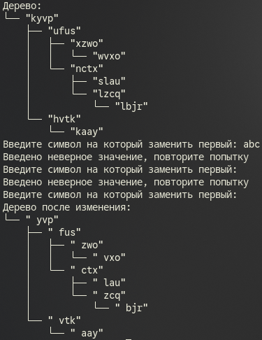
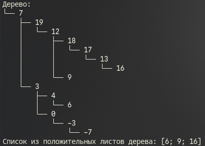

# Сурков Яков КМБ-1 Лабораторная №4

# Задание 1. Решить задачу на построение нового дерева по заданному (map)
## Задача 4
### Текст задачи
Дерево содержит строки. Заменить в каждой первый символ на заданный.

### Описание логики работы
В программе сначала автоматически выстраивается бинарное дерево, которое заполняется случайными текстовыми значениями из нескольких букв. После создания эта структура выводится на экран.

Далее программа просит пользователя ввести один символ, который станет заменой первого символа для всех элементов дерева. Если введено больше одного знака, она попросит повторить попытку.

Затем создается новое дерево, проходя по всему дереву, обрабатывая каждый элемент в созданной структуре и обновляя его: берёт введенный символ и ставит его на первое место. В завершение на экран выводится это новое дерево.

### Тестирование

# Задание 2. Решить задачу на получение заданного результата для указанного дерева (fold)
## Задача 4
### Текст задачи
Сформировать список из положительных листьев дерева (узел является листом, если у него нет ни левого, ни правого поддерева).

### Описание логики работы

В программе создаётся бинарное дерево, которая заполняется случайными числами в диапазоне от -10 до 20. Получившееся дерево выводится на экран.

Далее программа проходит всю структуру и проверяет элемент на соответствие условиям. Если элемент "лист" проверяется следующее условие :

  - если число больше нуля, оно добавляется в итоговый список
  - иначе, оно игнорируется

В итоге программа формирует и выводит на экран готовый список, состоящий только из положительных листьев дерева.

### Тестирование
